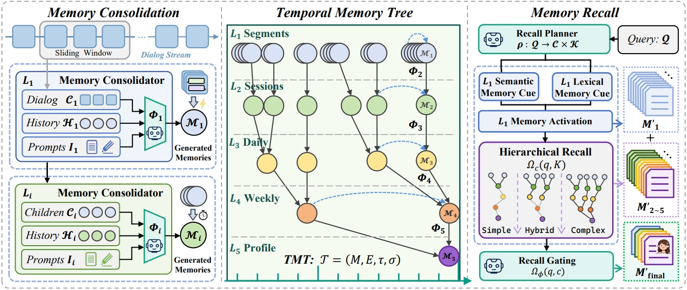

<p align="center">
  <a href="https://github.com/TiMEM-AI/timem-ai">
    
  </a>
</p>

<p align="center">
  <strong>TiMem: Make Your AI Evolve Over Time</strong>
</p>

<p align="center">
  <em>Predictive Cognitive Regulation Engine for Agents — Stable, Self-Evolving, Proactive</em>
</p>

<p align="center">
  TiMem is a <strong>Predictive Cognitive Regulation Engine</strong> powered by <strong>Temporal-Hierarchical Memory (TMT)</strong>. It enables agents to handle <strong>long-horizon tasks</strong> with <strong>stable execution</strong>, <strong>continuous self-evolution</strong>, and <strong>proactive user understanding</strong> — turning endless interactions into structured, multi-level cognition.
</p>

<p align="center">
  <a href="#-quick-start"><strong>🚀 Quick Start</strong></a>
  ·
  <a href="#-core-concepts"><strong>🧠 Core Concepts</strong></a>
  ·
  <a href="#-examples"><strong>📖 Examples</strong></a>
  ·
  <a href="#-cloud-service"><strong>☁️ Cloud Service</strong></a>
  ·
  <a href="docs/en/README.md"><strong>📚 Documentation Index</strong></a>
  ·
  <a href="README_CN.md"><strong>🇨🇳 中文文档</strong></a>
  ·
  <a href="#-research"><strong>📄 Research</strong></a>
</p>

<p align="center">
  <a href="https://timem.ai">
    
  </a>
  <a href="https://pypi.org/project/timem-ai">
    
  </a>
  <a href="https://github.com/TiMEM-AI/timem-ai/blob/main/LICENSE">
    
  </a>
  <a href="https://github.com/TiMEM-AI/timem-ai/stargazers">
    
  </a>
  <a href="https://aclanthology.org/">
    
  </a>
</p>

> **🎉 TiMem v1.1.0 - ACL 2026 Findings!** This release includes bug fixes for open-source repository, complete memory model definitions, and research-backed memory consolidation. **Paper accepted to ACL 2026 Findings.**

## 🔥 TiMem Highlights

- **Predictive Cognitive Regulation**: Proactively anticipates agent needs and user intent via temporal-hierarchical memory
- **5-Level Temporal Memory Tree (TMT)**: Explicit temporal ordering from fine-grained evidence to stable persona
- **Continuous Self-Evolution**: Agents learn and adapt from every interaction without fine-tuning
- **Long-Horizon Task Stability**: Sustained performance across extended sessions and complex workflows
- **Complexity-Aware Recall**: Adaptive retrieval that balances precision and efficiency
- **State-of-the-Art Performance**: Leading results on LoCoMo and LongMemEval-S benchmarks

# Introduction

[TiMem](https://github.com/TiMEM-AI/timem-ai) is a **Predictive Cognitive Regulation Engine** built on **Temporal-Hierarchical Memory (TMT)**. It provides infrastructure for agents to execute long-horizon tasks with stability, continuously learn and self-evolve from interactions, and proactively understand user needs — transforming raw dialogues into structured, actionable cognition.

### Key Features & Use Cases

**Core Capabilities:**
- **Temporal Memory Tree (TMT)**: 5-level hierarchy with explicit temporal ordering
- **Semantic-guided Consolidation**: No fine-tuning required, instruction-guided
- **Complexity-aware Recall**: Adapts retrieval scope to query complexity
- **Multi-LLM Support**: OpenAI, Claude, ZhipuAI, Qwen, local models

**Applications:**
- **Autonomous Agents**: Stable execution of complex, multi-step tasks with persistent context
- **AI Assistants**: Proactive, context-rich conversations that evolve with the user
- **Enterprise Workflows**: Long-horizon business processes with continuous learning
- **Customer Support**: Personalized help through deep user understanding across sessions
- **Education & Training**: Adaptive tutoring that tracks and predicts learner needs
- **Productivity**: Self-evolving personal assistants that anticipate user intent

## 🚀 Quick Start

### Self-Hosted Installation

Choose between our hosted cloud service or self-hosted deployment:

### Cloud Service (Recommended)

Get started in minutes without managing infrastructure:

```bash
# 1. Install SDK
pip install timem-ai

# 2. Configure credentials

export TIMEM_BASE_URL=https://api.timem.cloud
```

```python
import asyncio
from timem import AsyncMemory

async def main():
    # Initialize client
    memory = AsyncMemory(
        api_key="YOUR_API_KEY",
        base_url="https://api.timem.cloud"
    )

    # Add conversation memory
    result = await memory.add(
        messages=[
            {"role": "user", "content": "Hello, my name is Zhang Ming"},
            {"role": "assistant", "content": "Hello Zhang Ming!"}
        ],
        user_id="user_001",
        character_id="assistant",
        session_id="session_001"
    )
    print(f"Add memory: {'Success' if result['success'] else 'Failed'}")

    # Search relevant memories
    results = await memory.search(
        query="user's name",
        user_id="user_001",
        limit=5
    )
    print(f"Found {results.get('total', 0)} relevant memories")

    await memory.aclose()

asyncio.run(main())
```

### Self-Hosted (Open Source)

Requires database setup but offers full control.

**One-line CLI install (Recommended):**

```bash
# Clone and install
git clone https://github.com/TiMEM-AI/timem-ai.git
cd timem-ai
pip install -e .

# Interactive setup wizard (handles everything)
timem setup wizard
```

**Quick one-line setup with API key:**

```bash
timem setup quick --provider openai --api-key sk-your-key
```

**Manual setup (if you prefer):**

```bash
python -m venv .venv
source .venv/bin/activate  # Linux/Mac
# .venv\Scripts\activate   # Windows
pip install -r requirements.txt
cd migration && docker-compose up -d
```

**CLI Commands:**

```bash
timem start       # Start database containers
timem stop        # Stop database containers
timem status      # Check service status
timem doctor      # Run environment diagnostics
timem config init # Configure .env interactively
```

## 📖 Examples

Example files are located in [`cloud-service/examples/`](cloud-service/examples/):

| File | Description |
|------|------|
| [01_quick_start.py](cloud-service/examples/01_quick_start.py) | Quick start - Get started in 5 minutes |
| [02_add_memory.py](cloud-service/examples/02_add_memory.py) | Add memory examples |
| [03_search_memory.py](cloud-service/examples/03_search_memory.py) | Search memory examples |
| [04_chat_demo.py](cloud-service/examples/04_chat_demo.py) | Chat demo - AI assistant with memory |

### Run Examples

```bash
cd cloud-service/examples

# Configure environment variables
export TIMEM_BASE_URL=https://api.timem.cloud
export TIMEM_API_KEY=your_api_key

# Run examples
python 01_quick_start.py
python 02_add_memory.py
python 03_search_memory.py
python 04_chat_demo.py
```

## 🧠 Core Concepts

### System Architecture

<p align="center">
  
</p>

**TiMem's architecture consists of three core components:**

1. **Memory Consolidation (Left)**: Transforms raw conversations into hierarchical memories through semantic-guided consolidation across 5 levels (L1-L5)

2. **Temporal Memory Tree (Center)**: Organizes memories with explicit temporal ordering, from fine-grained fragments (L1) to stable persona profiles (L5)

3. **Complexity-Aware Recall (Right)**: Adapts retrieval scope based on query complexity, balancing precision and efficiency

### How It Works

```
User: "I want to learn Python"

L1: Extract facts → "User wants to learn Python"
L2: Summarize session → "User started Python learning journey"
L3: Daily pattern → "User is actively learning Python this week"
L4: Weekly trend → "User's learning schedule is weekday evenings"
L5: Stable profile → "User = Python developer in training"
```

Later query: "What is the user's technical background?"

→ **Complexity Analysis**: Simple factual query
→ **Hierarchical Recall**: Check L1 → L5
→ **Result**: User is learning Python (from L5 profile)
→ **Response**: "Based on our conversations, you're learning Python..."

## ☁️ Cloud Service

TiMem Cloud Service is a fully managed version that requires no deployment.

### 🌐 Console Access

[**Console**](https://console.timem.cloud) — Manage your TiMem cloud service (China)

> **Note**: Universal console (timem.ai) will be available soon.

### Quick Start

See full guide: [cloud-service/README.md](cloud-service/README.md)

### Cloud Service vs Self-Hosted

| Feature | Cloud Service | Self-Hosted |
|:--------|:--------------|:------------|
| **Deployment** | None required | Full setup |
| **Maintenance** | Platform managed | Self-managed |
| **Data Control** | Cloud storage | Full control |
| **Cost** | Pay-per-use | Fixed cost |
| **Customization** | Limited | Full |

### Related Documentation

| Document | Description |
|:---------|:------------|
| [cloud-service/README.md](cloud-service/README.md) | Complete cloud service guide |
| [cloud-service/api/authentication.md](cloud-service/api/authentication.md) | Authentication guide |
| [cloud-service/api/reference.md](cloud-service/api/reference.md) | REST API reference |

## 📄 Research

### Paper

**🎉 Accepted to ACL 2026 Findings!**

**TiMem: Temporal-Hierarchical Memory Consolidation for Long-Horizon Conversational Agents**

Long-horizon conversational agents have to manage ever-growing interaction histories that quickly exceed the finite context windows of large language models (LLMs). Existing memory frameworks provide limited support for temporally structured information across hierarchical levels, often leading to fragmented memories and unstable long-horizon personalization.

We present TiMem, a temporal–hierarchical memory framework that organizes conversations through a **Temporal Memory Tree (TMT)**, enabling systematic memory consolidation from raw conversational observations to progressively abstracted persona representations.

### Core Properties

1. **Temporal-Hierarchical Organization**: TMT provides explicit temporal ordering across 5 hierarchical levels
2. **Semantic-Guided Consolidation**: Memory integration across hierarchical levels without fine-tuning
3. **Complexity-Aware Memory Recall**: Balances precision and efficiency across queries of varying complexity

### Benchmark Results

| Benchmark | Metric | TiMem Performance |
|:----------|:-------|:------------------|
| **LoCoMo** | Accuracy | **75.30%** (State-of-the-Art) |
| **LongMemEval-S** | Accuracy | **76.88%** (State-of-the-Art) |
| **LoCoMo** | Memory Reduction | **52.20%** fewer tokens recalled |

**Manifold Analysis**: TiMem demonstrates clear persona separation on LoCoMo and reduced dispersion on LongMemEval-S, treating temporal continuity as a first-class organizing principle for long-horizon memory in conversational agents.

**Full Paper**: [arXiv:2601.02845](https://arxiv.org/abs/2601.02845)

## 🎉 📋 Changelog

Continuously maintained and upgraded:

- **2026.05.25** - **v1.1.0**: Bug fixes for open-source repository, restored missing `timem/models/` and `timem/schemas/`, paper accepted to ACL 2026 Findings
- **2026.02.08** - **v1.0.0**: Open source repository officially launched
- **2026.02.01** - Cloud service beta preview released
- **2026.01.06** - TiMem research paper published on arXiv

## 🗺️ Roadmap

Building towards the next generation of agent cognition infrastructure.

### 🧠 Memory Architecture Evolution

| Feature | Description | Impact |
|:--------|:------------|:-------|
| **L1→L2 Skip-Layer Persona Link** | When L1 fragments consolidate into L2 session summaries, jump-layer connections route low-frequency but high-signal features directly into the user persona module for structured, persistent storage. | Long-term user understanding that never degrades — critical traits (dietary restrictions, professional expertise, emotional patterns) survive beyond session boundaries without noise. |
| **Relation Summary Module** | Dedicated relation insight layer that extracts and maintains inferred relationship graphs between users, entities, and concepts across sessions. | Agents develop genuine "social intelligence" — understanding not just what users say, but how they relate to people, organizations, and topics in their world. |
| **Enhanced L3 Event Graph** | Upgrade L3 daily memory with native event-graph topology — temporal nodes linked by causal, sequential, and thematic edges rather than flat summaries. | Multi-hop temporal reasoning: "Because you rescheduled the meeting on Tuesday, your Wednesday workload increased, which explains today's stress." |
| **Multi-Hop Reasoning** | Extend the retrieval pipeline with explicit graph traversal across memory layers, supporting chained inference over distant but causally connected memories. | Complex questions requiring synthesis across weeks or months of interaction history answered with structured reasoning traces, not just similarity matching. |
| **Memory Tagging & Thematic Indexing** | Add a `tags` field to all memory records with automatic content-theme identification, creating a secondary thematic index alongside the temporal hierarchy. | 3-5x faster retrieval for broad thematic queries ("everything about my fitness goals") without sacrificing precision on specific factual lookups. |

### ⚡ Inference & Control Efficiency

| Feature | Description | Impact |
|:--------|:------------|:-------|
| **Small-Model Plan & Gating** | Replace LLM-based planning and gating decisions with fine-tuned small models (sub-7B parameters) specialized for TiMem's decision boundaries. | 10-50x latency reduction on plan generation and routing decisions, enabling real-time agent responsiveness while preserving decision quality. |

### 🤝 Multi-Agent & Operations

| Feature | Description | Impact |
|:--------|:------------|:-------|
| **Multi-Agent Collaboration** | Native support for shared memory spaces, role-aware delegation, and conflict-resolution protocols across collaborating agents. | Teams of specialized agents (researcher, planner, executor) share a unified cognitive substrate — no information loss during handoffs. |
| **Local-First Dashboard** | Privacy-centric web dashboard for memory inspection, debugging, and governance — runs entirely on localhost with zero cloud dependency. | Full data sovereignty. Users and operators can browse, audit, and curate what their agents remember without exposing sensitive history to external services. |

---

## 📚 Documentation & Support

### 📖 Documentation
- **[Full Documentation](docs/en/README.md)** - Complete docs hub
- **[Developer Guide](docs/en/developer-guide/README.md)** - 30-min developer quickstart
- **[Local Deployment Guide](skill/install.md)** - Self-hosted installation steps

### 🔧 API & SDK
- **[API Reference](docs/en/api-reference/overview.md)** - REST API docs
- **[Python SDK](docs/en/sdk/python/quickstart.md)** - Python integration
- **[Authentication](docs/en/api-reference/authentication.md)** - Auth guide

### 🛠️ Support
- **Issues**: [GitHub Issues](https://github.com/TiMEM-AI/timem/issues) — bug reports, feature requests, and questions welcome
- **Contributing**: [CONTRIBUTING.md](CONTRIBUTING.md) — we actively review PRs
- **Troubleshooting**: [docs/en/troubleshooting.md](docs/en/troubleshooting.md)

### 🤝 Community
We welcome all forms of contribution: code, documentation, bug reports, feature ideas, and feedback. Open an issue or pull request — every contribution makes TiMem better.

## 📝 Citation

If you use TiMem in your research, please cite:

```bibtex
@misc{li2026timemtemporalhierarchicalmemoryconsolidation,
      title={TiMem: Temporal-Hierarchical Memory Consolidation for Long-Horizon Conversational Agents},
      author={Kai Li and Xuanqing Yu and Ziyi Ni and Yi Zeng and Yao Xu and Zheqing Zhang and Xin Li and Jitao Sang and Xiaogang Duan and Xuelei Wang and Chengbao Liu and Jie Tan},
      year={2026},
      eprint={2601.02845},
      archivePrefix={arXiv},
      primaryClass={cs.CL},
      url={https://arxiv.org/abs/2601.02845},
}
```

## ⚖️ License

TiMem uses a dual-license model to balance openness and adoption:

- **Core Engine** — `timem/`, `storage/`, `services/`, `llm/`, `migration/`  
  [Apache License 2.0](LICENSE): patent-protected, suitable for production infrastructure
- **Tools & Utilities** — `tools/`, `cloud-service/`, `docs/`  
  [MIT License](tools/LICENSE): maximally permissive, encourages community tooling and commercial integration

See the respective LICENSE files for full terms. We welcome all contributions — PRs and issues make TiMem better for everyone.

## ⭐ Star History

[](https://star-history.com/#TiMEM-AI/timem&Date)

---

<p align="center">
  <strong>⭐ Star us on GitHub if TiMem helps you!</strong>
  <br><br>
  Supported by the TiMem team
</p>
